# 8bitter.py
8 bit-ifies an Image
```
Usage:
python 8bitter.py -p 1 -s 400 -o 1920,1080
 python 8bitter.py -s 600 -o 600,600 -n 100 -b COLOR_BG -e GLOW -r 1
 usage: 8bitter.py [-h] -s LOGOLEN -o OUTSZ [-p POKEINDEX] [-b BGTYPE]
                  [-e EFFECT] [-n NUM_BLOCKS] [-f OFFSET] [-r BRIGHT]

8bitter.py [Args] [Options] Detailed options -h or --help

optional arguments:
  -h, --help            show this help message and exit
  -s LOGOLEN, --8bitsize LOGOLEN
                        Side length of the 8 bit img.
  -o OUTSZ, --outsize OUTSZ
                        Size of the output image. (Height,Width)
  -p POKEINDEX, --pokeNum POKEINDEX
                        Pokemon index number
  -b BGTYPE, --bgtype BGTYPE
                        Background style. NONE|COLOR_BG. NONE: No background.
                        COLOR_BG: Colored background.
  -e EFFECT, --effect EFFECT
                        Effect. NONE|GLOW|OUTLINE. NONE: No effects.GLOW:
                        Glowing outline. OUTLINE: Black outline.
  -n NUM_BLOCKS, --numblocks NUM_BLOCKS
                        Number of blocks for the height
  -f OFFSET, --offset OFFSET
                        8 bit image offset
  -r BRIGHT, --bright BRIGHT
                        Background color brightness level. 0-8
```

## Samples:

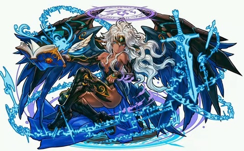
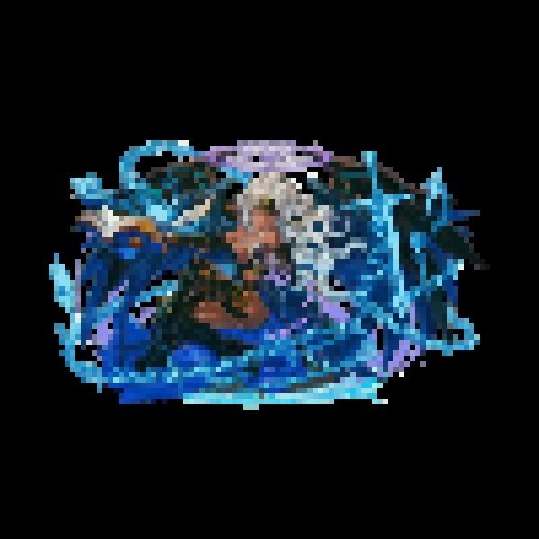
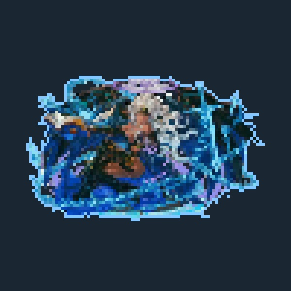
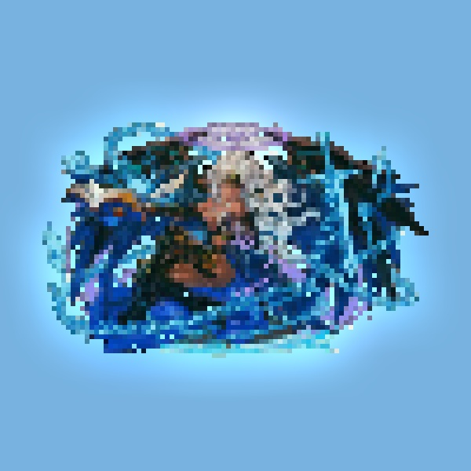

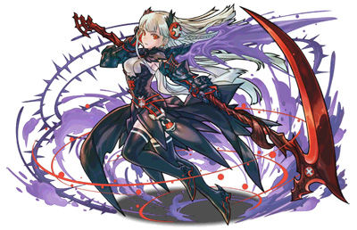
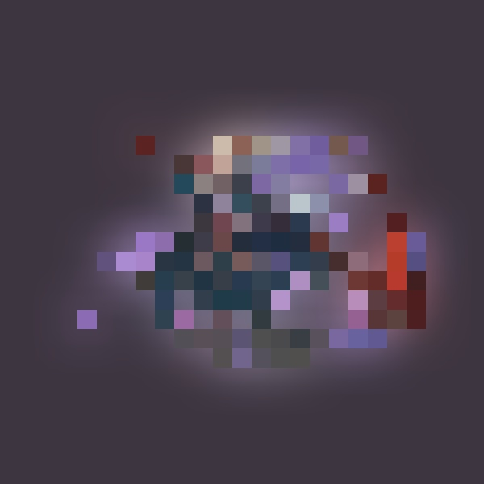
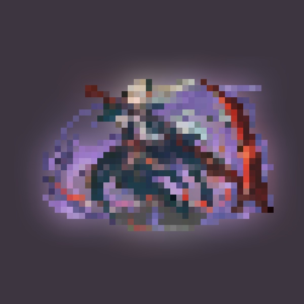
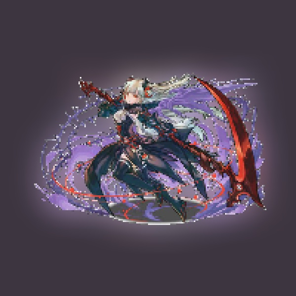


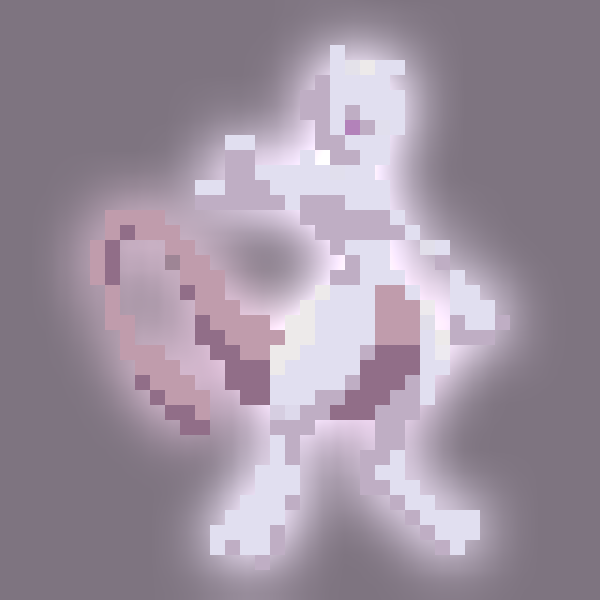

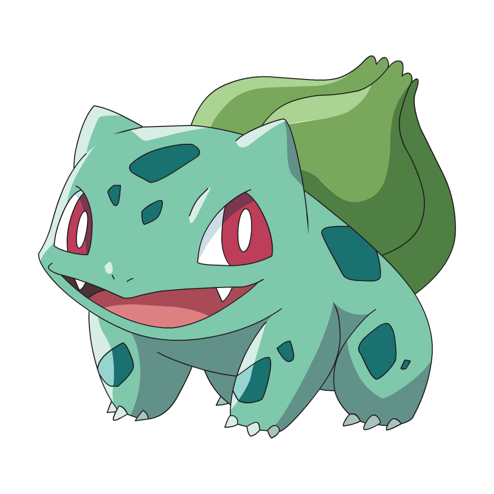
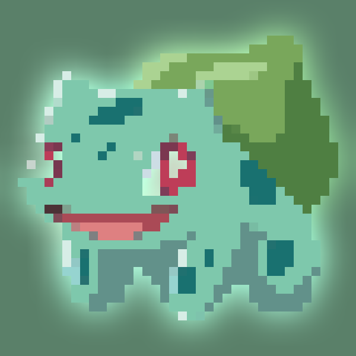
